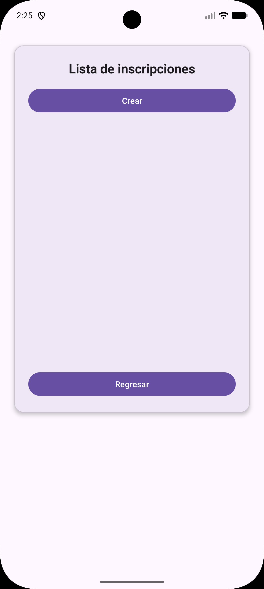
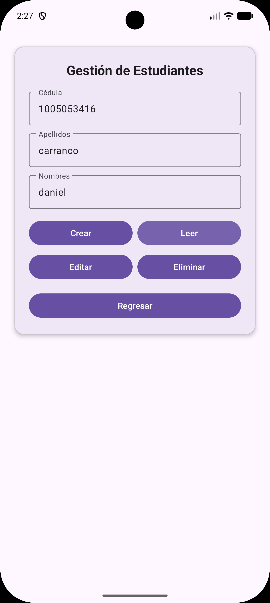
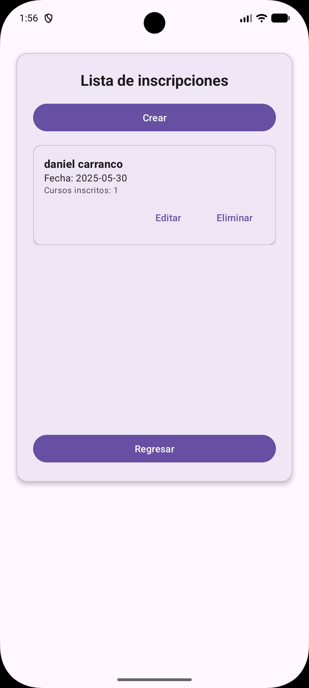
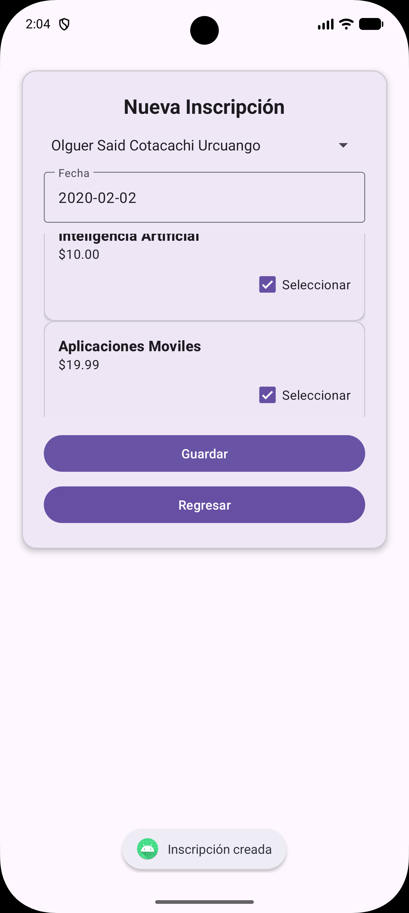
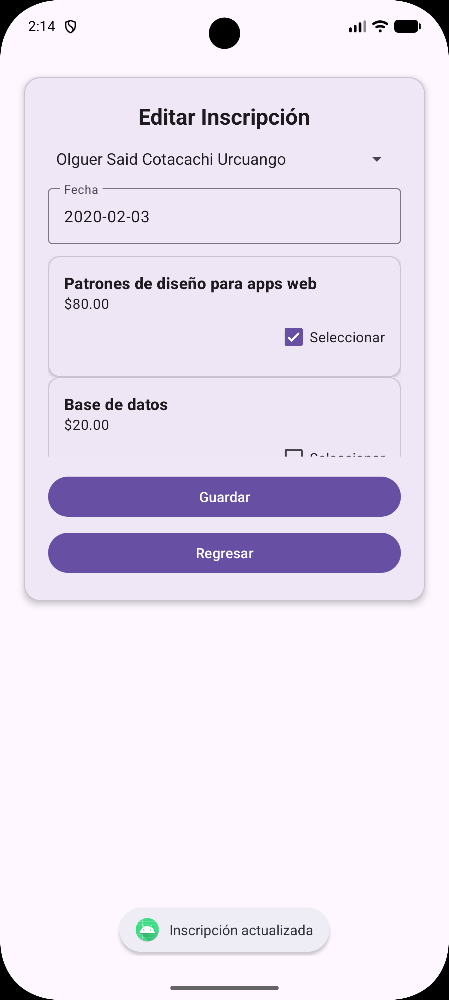
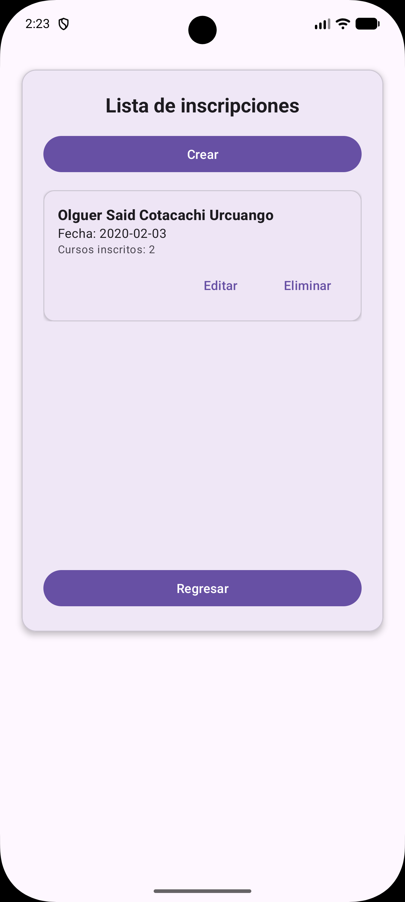

# Sistema de Inscripciones y Matriculación - App Android

Aplicación móvil nativa desarrollada en Java para Android que permite gestionar estudiantes, cursos y sus respectivas inscripciones mediante operaciones CRUD completas, consumiendo una API RESTful externa.

## Arquitectura y Tecnologías

- Frontend: Android nativo (Java, XML), implementando UI dinámica con RecyclerViews, Adapters y gestión de concurrencia básica con hilos para evitar bloqueos en el UI Thread.
- Cliente de Red: OkHttp3 para peticiones asíncronas y Gson para la serialización/deserialización de JSON.
- Backend: API REST alojada en Azure.
- Base de Datos: PostgreSQL.

## Flujo Transaccional

La aplicación está diseñada bajo una estructura de catálogos y un flujo transaccional maestro-detalle:

1. Gestión de Catálogos: Permite realizar operaciones CRUD sobre las entidades base (Estudiantes y Cursos). Las listas se actualizan dinámicamente tras cada transacción de red.
2. Proceso de Inscripción:
   - Al iniciar una matrícula, la app dispara peticiones asíncronas para precargar el catálogo de estudiantes (Spinner) y la oferta de cursos (RecyclerView).
   - El estado de los cursos seleccionados se maneja en memoria mediante una estructura `HashSet` para garantizar selecciones únicas y un rendimiento de búsqueda O(1).
3. Persistencia de Datos: La app ensambla el DTO estructurado y envía la petición a la API. Al finalizar, la vista principal intercepta el resultado mediante `ActivityResultLauncher` y fuerza una recarga automática del historial.

## Capturas Generales del Sistema

| Historial de Inscripciones | Formulario de Creación | Gestión de Estudiantes |
| :---: | :---: | :---: |
|  |  |  |

---

## Flujo de Operaciones (CRUD)

A continuación se detalla la interacción con la API REST para cada uno de los módulos principales.

### Módulo: Estudiantes

**1. Listado de Estudiantes (GET)**
Recuperación asíncrona del catálogo de estudiantes y renderizado en la interfaz mediante un `RecyclerView`.

**2. Creación de Estudiante (POST)**
Formulario de registro que ensambla el objeto y envía el payload a la API.

**3. Edición de Estudiante (PUT)**
Precarga de los datos del estudiante seleccionado para su modificación y sincronización con el servidor.

**4. Eliminación de Estudiante (DELETE)**
Ejecución del borrado físico/lógico en el backend y actualización inmediata del estado de la vista.

---

### Módulo: Cursos

**1. Catálogo de Cursos (GET)**
Visualización de la oferta académica disponible extraída directamente del backend.

**2. Alta de Curso (POST)**
Ingreso de un nuevo curso, estableciendo nombre y precio, actualizando el catálogo general.

**3. Actualización de Curso (PUT)**
Edición de las propiedades de un curso existente manteniendo la integridad de su ID.

**4. Baja de Curso (DELETE)**
Remoción del curso de la base de datos.

---

### Módulo: Inscripciones (Maestro-Detalle)

**1. Historial de Inscripciones (GET)**
Vista principal que cruza las tablas y muestra la cabecera de la matrícula junto con la cantidad de cursos registrados.

**2. Nueva Inscripción (POST)**
Formulario transaccional. Dispara peticiones en hilos secundarios para poblar el catálogo de estudiantes y la oferta de cursos, ensamblando el DTO completo para el registro.

**3. Modificación de Inscripción (PUT)**
Apertura del formulario en modo edición. Realiza un GET específico por ID para inyectar el estado previo en los componentes, permitiendo mutar el array de detalles.

**4. Anulación de Inscripción (DELETE)**
Eliminación del registro transaccional en la base de datos y refresco reactivo del historial.
