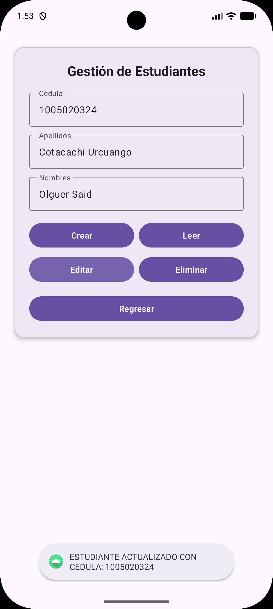
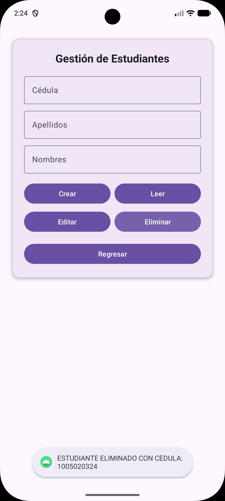
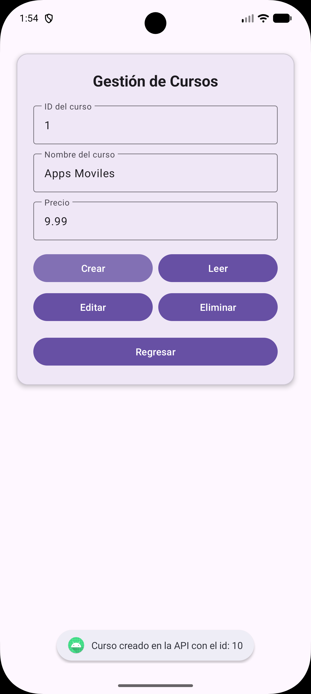
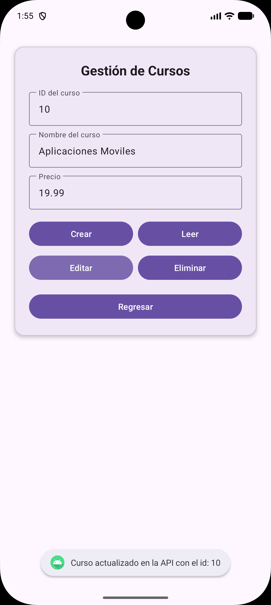
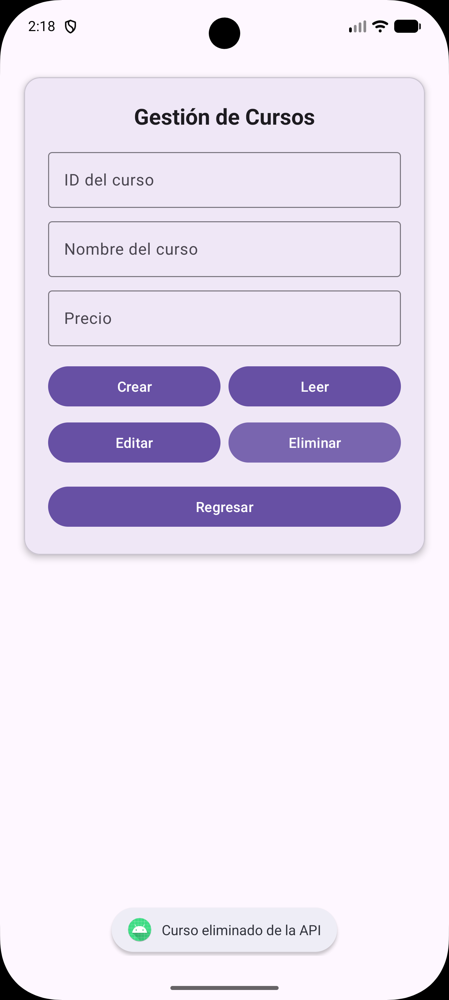
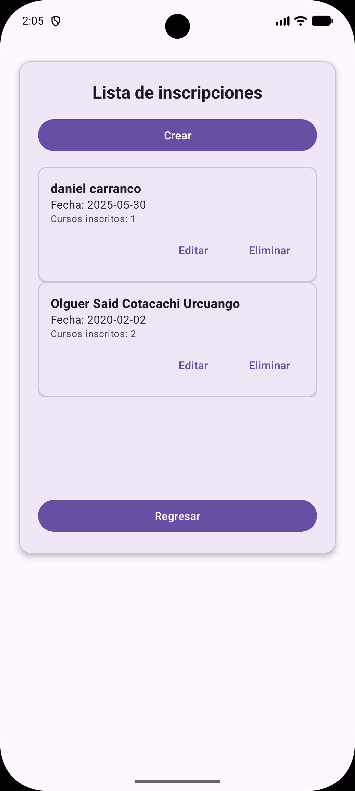
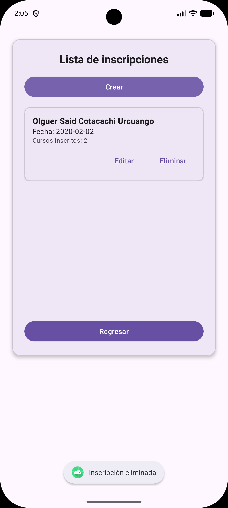

# Sistema de Inscripciones y Matriculación - App Android

Aplicación móvil nativa desarrollada en Java para Android que permite gestionar estudiantes, cursos y sus respectivas inscripciones mediante operaciones CRUD completas, consumiendo una API RESTful externa.

## Arquitectura y Tecnologías

- Frontend: Android nativo (Java, XML), implementando UI dinámica con RecyclerViews, Adapters y gestión de concurrencia básica con hilos para evitar bloqueos en el UI Thread.
- Cliente de Red: OkHttp3 para peticiones asíncronas y Gson para la serialización/deserialización de JSON.
- Backend: API REST alojada en Azure.
- Base de Datos: PostgreSQL.

## Flujo Transaccional

La aplicación está diseñada bajo una estructura de catálogos y un flujo transaccional maestro-detalle:

1. Gestión de Catálogos: Permite realizar operaciones CRUD sobre las entidades base (Estudiantes y Cursos). Las listas se actualizan dinámicamente tras cada transacción de red.
2. Proceso de Inscripción:
   - Al iniciar una matrícula, la app dispara peticiones asíncronas para precargar el catálogo de estudiantes (Spinner) y la oferta de cursos (RecyclerView).
   - El estado de los cursos seleccionados se maneja en memoria mediante una estructura `HashSet` para garantizar selecciones únicas y un rendimiento de búsqueda O(1).
3. Persistencia de Datos: La app ensambla el DTO estructurado y envía la petición a la API. Al finalizar, la vista principal intercepta el resultado mediante `ActivityResultLauncher` y fuerza una recarga automática del historial.

## Capturas Generales del Sistema

| Historial de Inscripciones | Gestión de Estudiantes | Gestión de Cursos |
| :---: | :---: | :---: |
|  |  |  |

---

## Flujo de Operaciones (CRUD)

A continuación se detalla la interacción con la API REST para cada uno de los módulos principales.

### Módulo: Estudiantes

**1. Listado de Estudiantes (GET)**
Se requiere ingresar la **Cédula** del estudiante. Al presionar "Leer", la aplicación ejecuta una petición asíncrona `GET /estudiantes/{id}` en un hilo secundario para no bloquear la interfaz. El JSON resultante se procesa y autocompleta los campos restantes del formulario.

**2. Creación de Estudiante (POST)**
Se deben ingresar manualmente: **Cédula, Apellidos y Nombres**. Internamente, la app construye un objeto DTO, lo serializa a formato JSON y dispara una solicitud `POST /estudiantes`. Si el backend responde con éxito (HTTP 2xx), se notifica la creación y se limpia la vista.

**3. Edición de Estudiante (PUT)**
Requiere realizar primero la lectura (GET) de un estudiante por su **Cédula**. Tras modificar los campos deseados (**Nombres o Apellidos**), se envía una petición `PUT /estudiantes/{id}` con el payload actualizado. El backend sobrescribe la información conservando la llave primaria intacta.

**4. Eliminación de Estudiante (DELETE)**
Solo necesita que esté ingresada la **Cédula** del estudiante. Se emite un request `DELETE /estudiantes/{id}` y, tras confirmarse la baja en la base de datos PostgreSQL, la interfaz resetea sus campos automáticamente.

---

### Módulo: Cursos

**1. Catálogo de Cursos (GET)**
Para consultar la información de un curso en específico, se ingresa su **ID del curso**. Al invocar la acción de lectura, se efectúa un `GET /cursos/{id}` que hidrata el formulario con el respectivo **Nombre del curso** y su **Precio** actual.

**2. Alta de Curso (POST)**
El usuario define los tres campos base: **ID del curso, Nombre del curso y Precio**. Estos conforman un JSON que es enviado por `POST /cursos` al servidor en Azure, donde se valida y registra la oferta académica en la base de datos.

**3. Actualización de Curso (PUT)**
Habiendo cargado un curso por su **ID**, el usuario ajusta parámetros como el **Precio** o **Nombre**. La aplicación transmite un request `PUT /cursos/{id}` encapsulando los nuevos valores para su actualización en la nube.

**4. Baja de Curso (DELETE)**
A partir del **ID del curso** ingresado, se lanza el endpoint `DELETE /cursos/{id}`. Esto lleva a cabo la remoción definitiva del registro en el backend y limpia el formulario tras una validación exitosa de OkHttp.

---

### Módulo: Inscripciones (Maestro-Detalle)

**1. Historial de Inscripciones (GET)**
Pantalla que se carga por defecto al iniciar la app. Despacha un `GET /inscripciones` y mapea el JSON de respuesta a un *RecyclerView*. El consolidado exhibe el nombre del estudiante titular de la matrícula combinado con la sumatoria de sus cursos registrados.

**2. Nueva Inscripción (POST)**
Requiere seleccionar un **Estudiante** (desde un Spinner alimentado asíncronamente) y marcar múltiples **Cursos** (mediante *Checkboxes* controlados con un `HashSet` en memoria). La app ensambla el DTO transaccional completo (maestro-detalle) y lo despacha vía `POST /inscripciones`.

**3. Modificación de Inscripción (PUT)**
Al seleccionar un ítem desde el historial, se efectúa un `GET /inscripciones/{id}` para inyectar el estado previo en el Spinner y marcar los Checkboxes correspondientes. Al guardar cambios, se envía un `PUT /inscripciones/{id}` sobreescribiendo el arreglo interno de cursos asociados a la matrícula.

**4. Anulación de Inscripción (DELETE)**
Se selecciona una matrícula específica desde la vista general para procesar su borrado (`DELETE /inscripciones/{id}`). La base de datos destruye la relación maestro-detalle de forma atómica y, al retornar al listado, se invoca una recarga automática (GET) para refrescar visualmente el historial.
